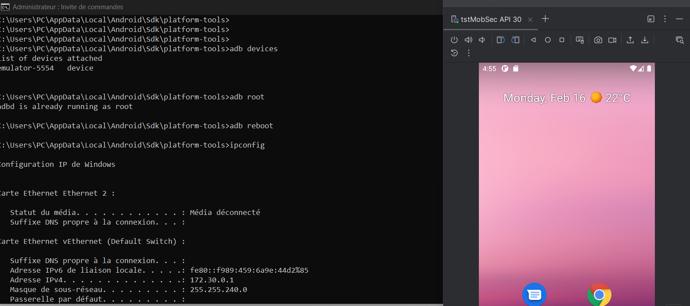
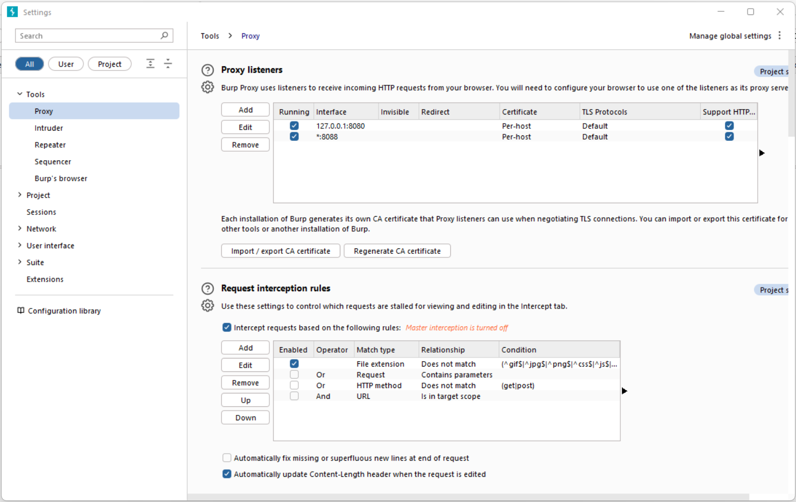
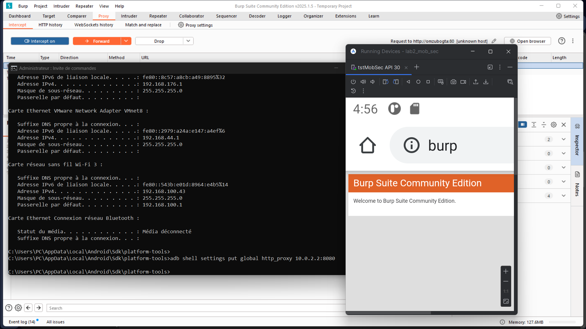
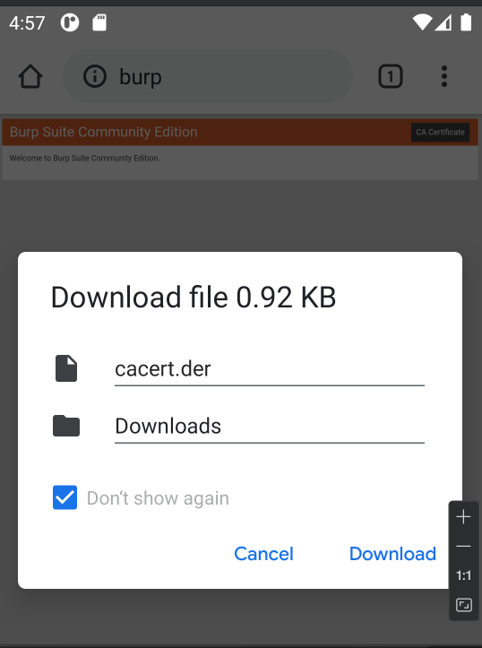
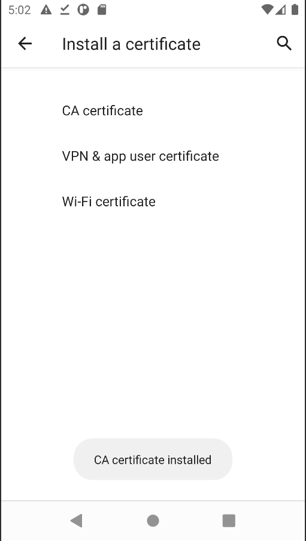
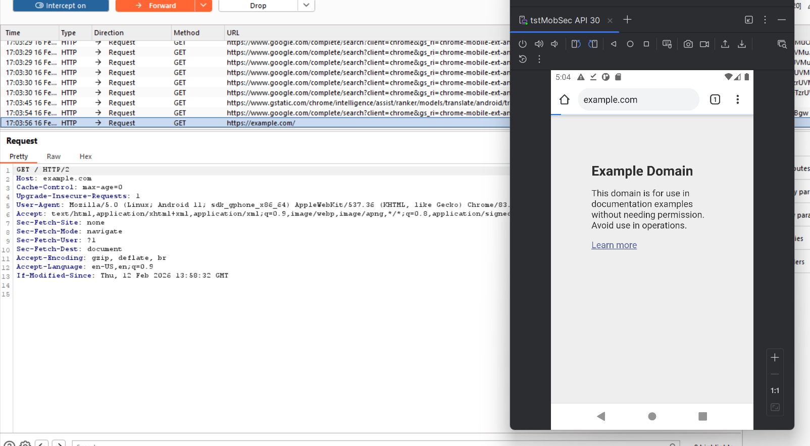
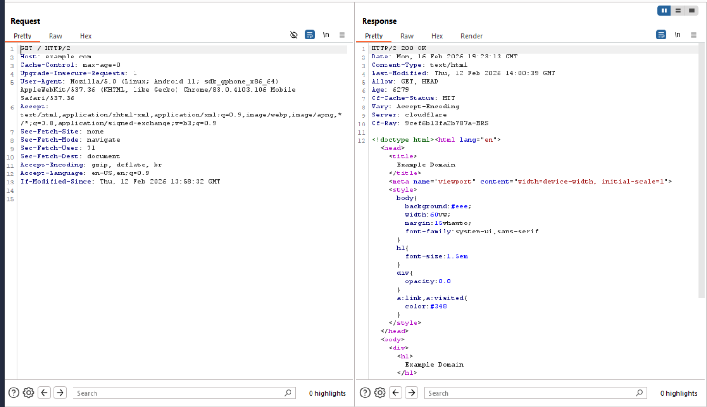
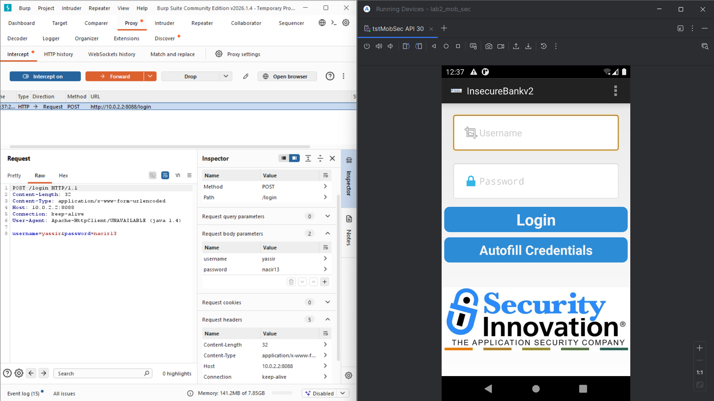
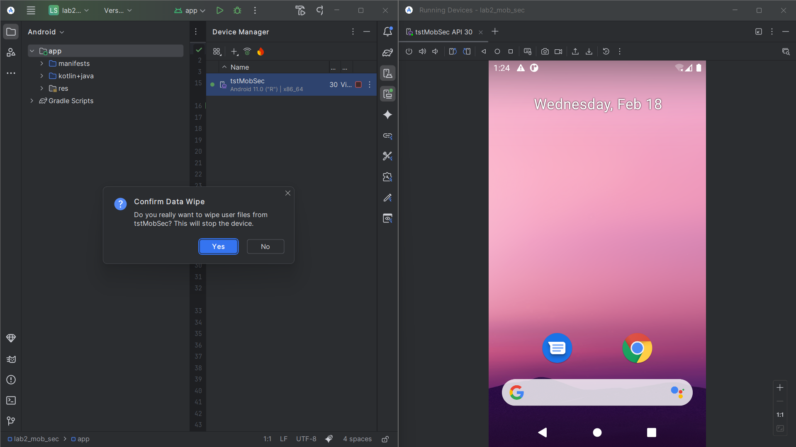

# LAB d'observation du trafic HTTP(S) Android-(AVD) avec Burp Suite

Dans ce lab nous auront besoin d'une AVD, pour ce lab j'ai choisie l'appareil Google Pixel 5 avec 
une image Google API 30, de notre machine windows qui va servir comme proxy et de Burp suite community
qui va intercepter toutes les requetes HTTP et HTTPS en utilisant notre proxy (notre Windows).

On commence tout d'abord par lancer notre AVD puis nous activons les privilèges root afin de permettre certaines manipulations avancées :

Ensuite, nous configurons Burp Suite en ajoutant un Proxy Listener qui sera paramétré pour écouter sur toutes les interfaces réseau, ce qui permet à l’émulateur Android de communiquer avec Burp :

L’étape suivante consiste à configurer le proxy au niveau de l’AVD à l’aide de la commande ADB suivante : adb shell settings put global http_proxy 10.0.2.2:8080. Cette commande définit l’adresse de la machine hôte (Windows) comme proxy HTTP/HTTPS pour l’émulateur Android. Après la configuration du proxy, nous vérifions la connectivité en accédant à la page http://burp depuis le navigateur de l’émulateur et elle permet également de télécharger le certificat CA de Burp, nécessaire pour intercepter les communications HTTPS, cette installation établit une relation de confiance entre l’AVD et Burp Suite qui va permettre à Burp de déchiffrer les échanges TLS.

Finalement, pour vérifier que le certificat CA a été bien installé et le trafic transite bien par Burp suite, on a interceter une requête HTTPS vers un domaine de test (https://example.com) : 

Pour effectuer un autre test simple avec Burp Suite, nous avons choisi l’application InsecureBankv2 (MASTG-APP-0010), qui est une application Android utilisée dans le cadre des tests de pénétration et de sécurité mobile. Nous avons intercepté la requête de connexion (login) et constaté que l’application envoie les paramètres d’authentification (username et password) en clair dans le corps de la requête. Aucun cookie ni token de sécurité n’est présent dans cette requête. Il est donc recommandé d’utiliser le protocole HTTPS afin d’éviter la transmission des identifiants en clair, comme observé dans ce cas, et c'est également important de limiter les tentatives de connexion et de sécuriser les cookies de session avec les attributs Secure, HttpOnly et SameSite afin d’améliorer la protection globale de l’application.

Comme recommandé, et à la fin de ces tests, notre AVD a été réinitialisé via Android Studio à l’aide de l’option Wipe Data, afin de restaurer un environnement propre pour d’éventuels tests ultérieurs : 

